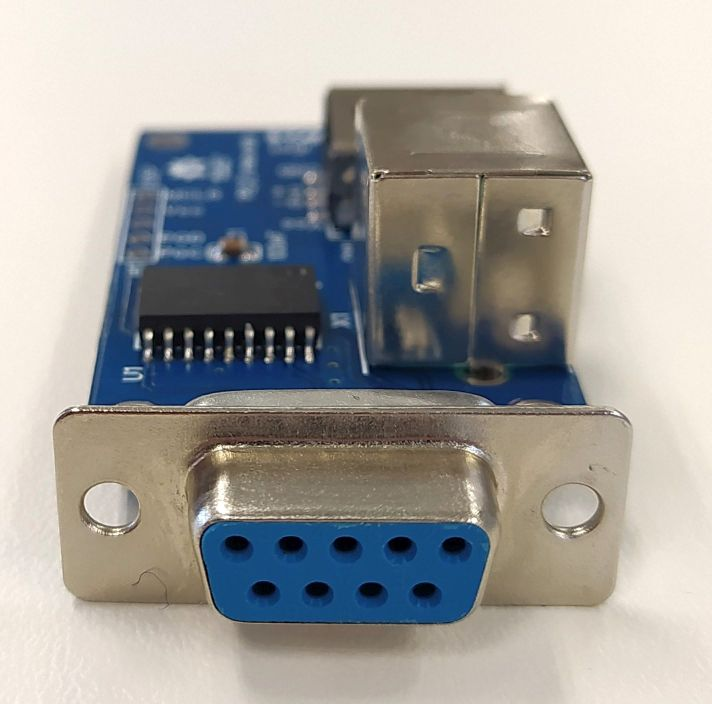

# AMIGA_PS2_Mouse
Use a PS/2 mouse with an Amiga computer.   There are two versions (DIP-18 and SOIC-18) in this repository.  
  
  
You can only use mice that are supporting the PS2 protocol. There are some few PS/2 optical mice (USB Type) available.  
I got this LOGITECH mouse that works well.  
  
  

# The story began ...
I bought a used Commodore AMIGA500 ... but ... there was no mouse that I could use.   For some reason, there are used AMIGA mice for too much money out there in the market.
So I searched for a better alternative solution an found the webpage of <strong>Henryk Richter</strong> http://bax.comlab.uni-rostock.de/en/hardware/ps2-amiga-maus/. Special thanks to Henryk.  
I modified his schematic to this version and added a mini-DIN and USB connector to the PCB.  
After I milled a prototype PCB I realized, that the HEX-file I got from his webpage do not work. I had no FUSEBIT information and that was the reason.
I contacted Henryk and he sent me his old PIC16F628A MCU so that I could salvage the program with a TL866 programmer.

Take a look into the <a href="Schematic_AMIGA_USB_Mouse_V1_DIP.pdf"> DIP-SCHEMATIC</a> or into the 
    <a href="Schematic_AMIGA_USB_Mouse_V1_SOIC.pdf"> SOIC-SCHEMATIC </a>for further information.

# The DIP-18 version ...
   
   
   

# The SOIC-18 version ...
   
   
   

# Fabrication files
You can find a panelized GERBER file version and a single file version.  
The panelized version should work for the most PCB manufacturer.
I ordered by JLCPCB.

# Contact
For any questions (technical / experience), please use the issue tracking system of github.

Greetz 

JDet
